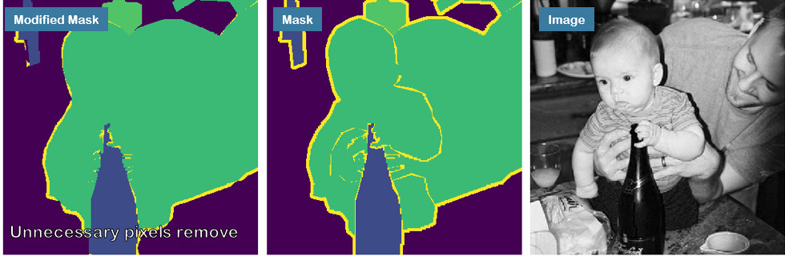
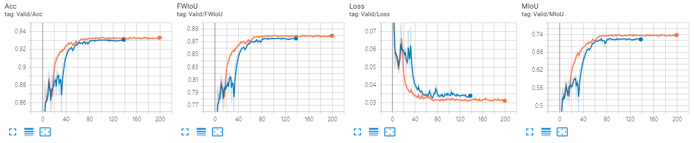

# **[EE543]** Computer Vision Final Project
# FriendsPseudoNet
#### 20195213 Hyeonsoo Lee

## Project Description
  

### Problem
- There are unlabeled pixels and boundary pixels in PASCAL VOC 2012 Segmentation Dataset.  
- It's hard to annotate perfectly in segmentation dataset.

### Proposed Method
- Self-Correcting Mask in Training Phase

### Examples

### PseudoCode

### Result

Blue: baseline (mIoU: 0.7302)  
Orange: single proposed model (mIoU: 0.7442)

## Path modificiation is needed in 
- config/single.yaml, config/baseline_friend2.sh
- DATA_DIRECTORY for dataset path
- ROOT_DIRECTORY for this git folder path

## Execution
### PseudoNet
- execute shell/single.sh (for PseudoNet)
- execute shell/baseline_friend2.sh (for baseline)
### FriendsPseudoNet
- execute shell/friend_label3.sh (for FriendPseudoNet)
- execute shell/frined_label2.sh (for baseline)