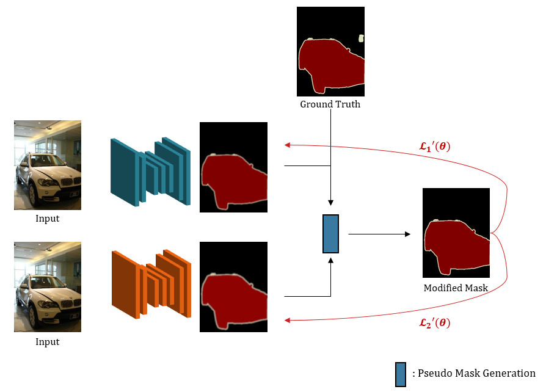

# **[EE543]** Computer Vision Final Project
# FriendsPseudoNet
#### 20195213 Hyeonsoo Lee

## Project Description
</img> 

## Path modificiation is needed in 
- config/single.yaml, config/baseline_friend2.sh
- DATA_DIRECTORY for dataset path
- ROOT_DIRECTORY for this git folder path

## Execution
### PseudoNet
- execute shell/single.sh (for PseudoNet)
- execute shell/baseline_friend2.sh (for baseline)
### FriendsPseudoNet
- execute shell/friend_label3.sh (for FriendPseudoNet)
- execute shell/frined_label2.sh (for baseline)